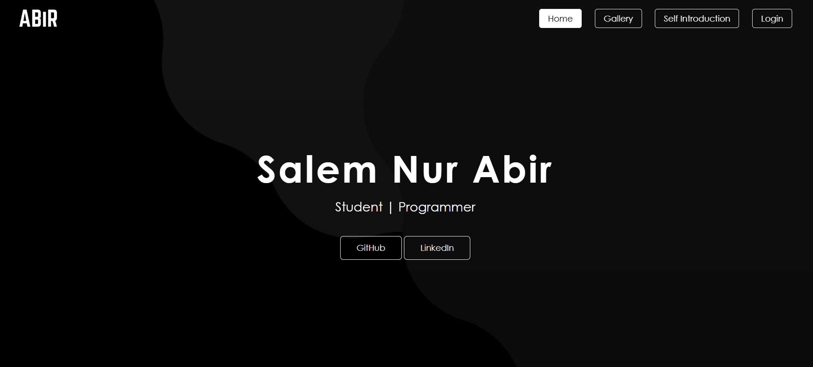
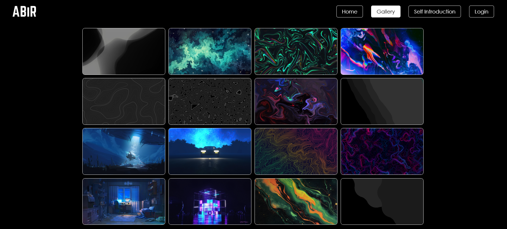
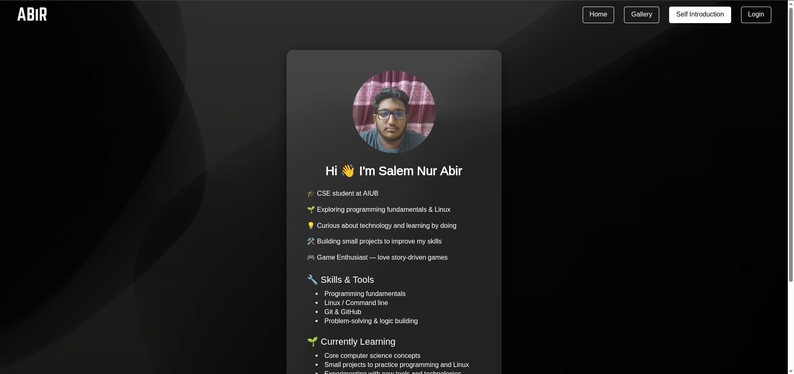
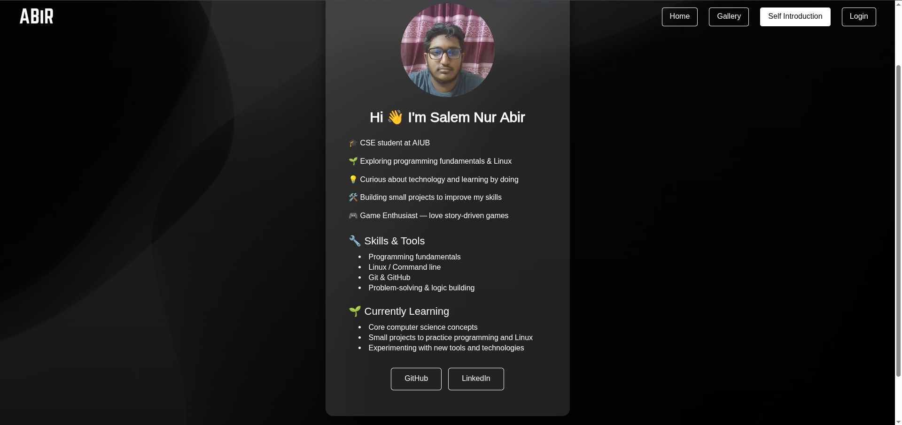
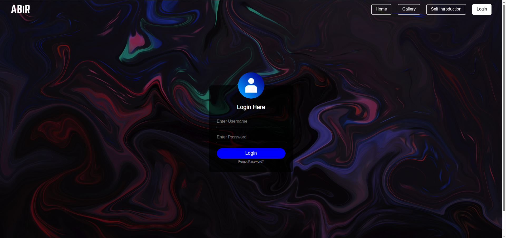

# Personal Website

This repository contains the code for a personal website project. It includes multiple pages with navigation, styling, and images.

---

## Files and Structure

- **HTML Files**
  - `index.html` — Home page
  - `gallery.html` — Gallery page
  - `introduction.html` — Self introduction page
  - `login.html` — Login page

- **CSS Files**
  - `main.css` — Global styles used across all pages
  - `gallery.css` — Styles specific to the gallery page
  - `introduction.css` — Styles specific to the introduction page
  - `login.css` — Styles specific to the login page

- **Images**
  - Stored in the `images` folder
  - Used for backgrounds, profile pictures, and gallery items

---

## Features

- Fixed navigation bar on all pages
- Opaque introduction box with profile information
- Gallery with hover zoom effect on images
- Login page with styled form
- External links to GitHub and LinkedIn
- Background images with dimmed overlay for better readability

---

## Preview

### Home Page

### Gallery Page

### Introduction Page

### Login Page

---
